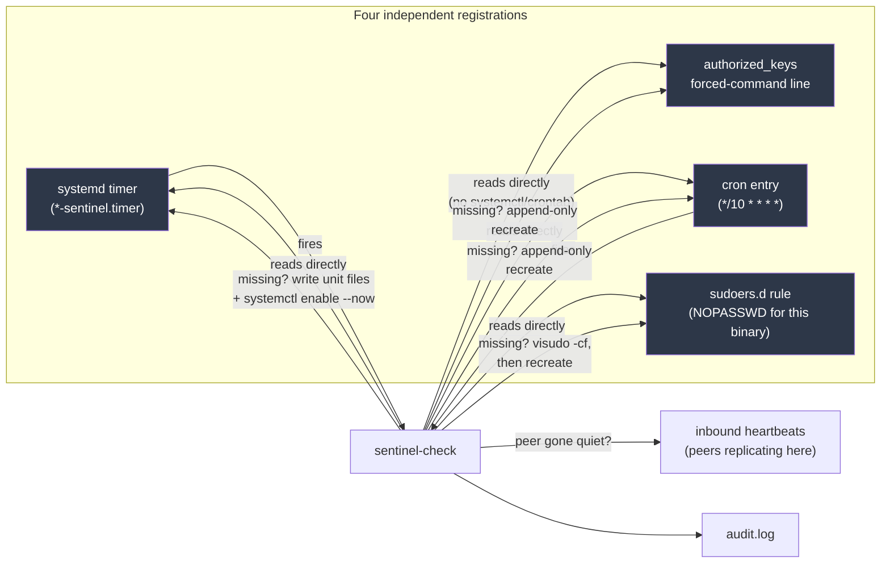
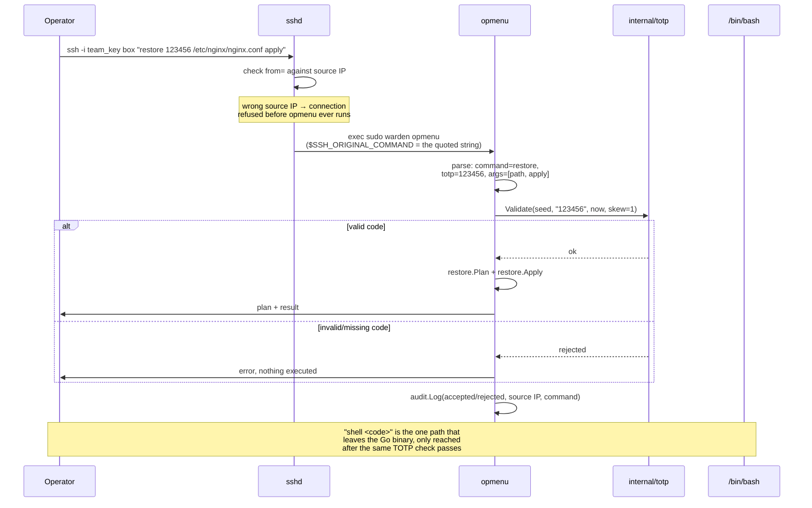
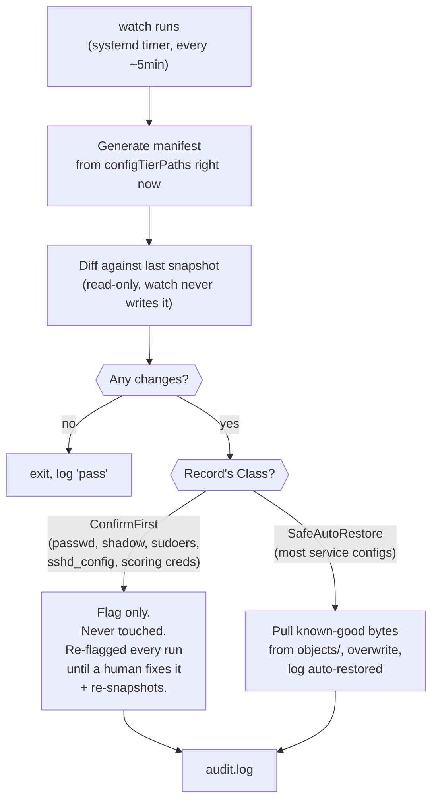
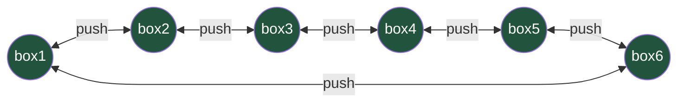
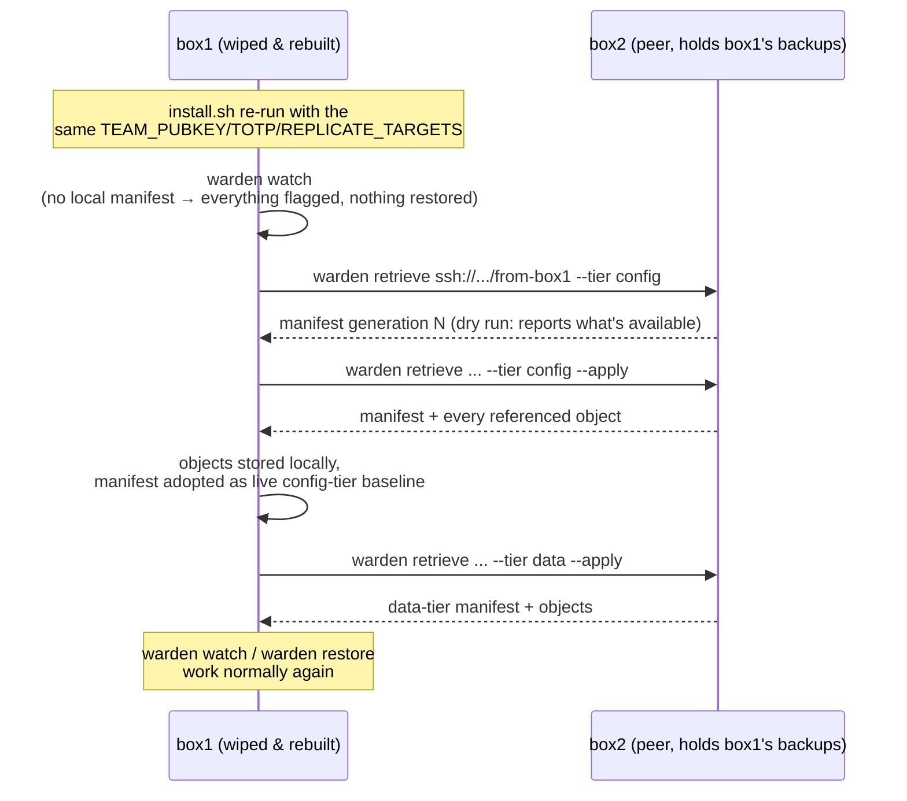

# Architecture Diagrams

Visual companions to [DESIGN.md](DESIGN.md) (why it's built this way) and [USAGE.md](USAGE.md) (what each command does). GitHub renders these Mermaid blocks natively.

## Component overview

Components on one host. Timers and cron invoke short-lived commands.

```mermaid
flowchart TB
    subgraph Triggers["Triggers (systemd timers + cron)"]
        T_watch["*-watch.timer\nevery 5min ± 90s"]
        T_snapcfg["*-snap-cfg.timer\nevery 5min ± 60s"]
        T_snapdata["*-snap-data.timer\nevery 1h ± 5min"]
        T_sentinel["*-sentinel.timer\nevery 10min ± 2min"]
        T_cron["cron entry\nevery 10min"]
        T_replicate["*-replicate.timer\nevery 15min ± 3min"]
        T_scan["*-scan.timer\nevery 10min ± 2min"]
    end

    subgraph Binary["warden binary (one file, disguised name)"]
        watch["watch"]
        snapshot["snapshot --tier config|data"]
        sentinelcheck["sentinel-check"]
        replicate["replicate"]
        scan["scan"]
        restore["restore"]
        opmenu["opmenu\n(forced command only)"]
    end

    subgraph State["/var/lib/&lt;binary-name&gt;/ (named to blend in)"]
        manifests["manifest-config.json\nmanifest-data.json\nmanifests-config/\nmanifests-data/"]
        objects["objects/\n(content-addressed, gzip)"]
        auditlog["audit.log\n(JSON lines, capped + rotated)"]
        anomalybaselines["anomaly/\n(per-check baselines)"]
    end

    subgraph External["Outside this box"]
        watchedfiles["Watched files\n/etc/passwd, nginx.conf, ..."]
        akeys["opmenu-user's authorized_keys\n+ /etc/sudoers.d/<opmenu-user>"]
        units["/etc/systemd/system/*.timer/.service"]
        peers["Replication peers\n(other boxes in the mesh)"]
        operator["Operator's SSH client\n(team key + TOTP)"]
    end

    T_watch --> watch
    T_snapcfg --> snapshot
    T_snapdata --> snapshot
    T_sentinel --> sentinelcheck
    T_cron --> sentinelcheck
    T_replicate --> replicate
    T_scan --> scan

    watch <-- "read only" --> manifests
    watch <-- "read for repair" --> objects
    watch --> auditlog
    watch <-- "diff / auto-restore" --> watchedfiles

    snapshot --> manifests
    snapshot --> objects
    snapshot --> auditlog
    snapshot <-- "hash + read" --> watchedfiles

    sentinelcheck <-- "check / recreate" --> akeys
    sentinelcheck <-- "check / recreate" --> units
    sentinelcheck <-- "check / recreate" --> T_cron
    sentinelcheck --> auditlog

    replicate <-- "push (additive-only)" --> peers
    replicate --> manifests
    replicate --> objects
    replicate <-- "push new entries" --> auditlog
    replicate -- "leaves a heartbeat" --> peers

    scan --> auditlog
    scan <-- "baselines" --> anomalybaselines

    restore <-- "pull known-good" --> objects
    restore --> watchedfiles
    restore --> auditlog

    operator -- "ssh, key forces command=" --> opmenu
    opmenu --> restore
    opmenu -.-> sentinelcheck
    opmenu --> auditlog
```

## Persistence: how it survives a kill attempt

Persistence uses four registrations: a systemd timer, cron entry, forced-command SSH key, and sudoers rule. The timer and cron entry invoke `sentinel-check`, which verifies and repairs missing registrations.

`sentinel-check` has two independent triggers. Either can restore the other. The SSH key and sudoers rule are checked registrations, not triggers. Removing both triggers stops scheduled repair until one is restored.

The access layer uses the existing SSH service. Only the authenticated shell command starts a shell; status and restore run inside the binary.

The `binary-backup` registration maintains `/var/lib/<name>/.spare`. Before invoking Warden, the cron command checks for a missing binary and copies it from the spare using `test`, `cp`, and `chmod`.

Sentinel also verifies watch, both snapshot tiers, scan, and configured replication through `timerRegistration` in `cmd/warden/registrations.go`.

## opmenu: what happens on a forced-command connection

## Watch: detect, classify, act

## Backup lineage: two tiers, never sharing a baseline

Separate manifests prevent a data snapshot from replacing the config baseline. An earlier shared-manifest implementation had this defect; see PLAN.md Phase 6.

## Mesh replication and recovery (multiple boxes)

A bidirectional ring across N defended boxes: every box pushes to both neighbors, so every box's data has 3 total copies (itself + 2 neighbors) and every replication relationship is mutual.

Each arrow represents client-side additive writes. The current SSH transport does not restrict a compromised key to these operations. Use separate receiving accounts and independent retention to protect prior backups.

