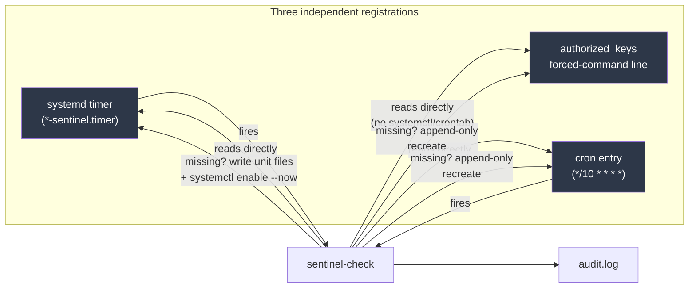
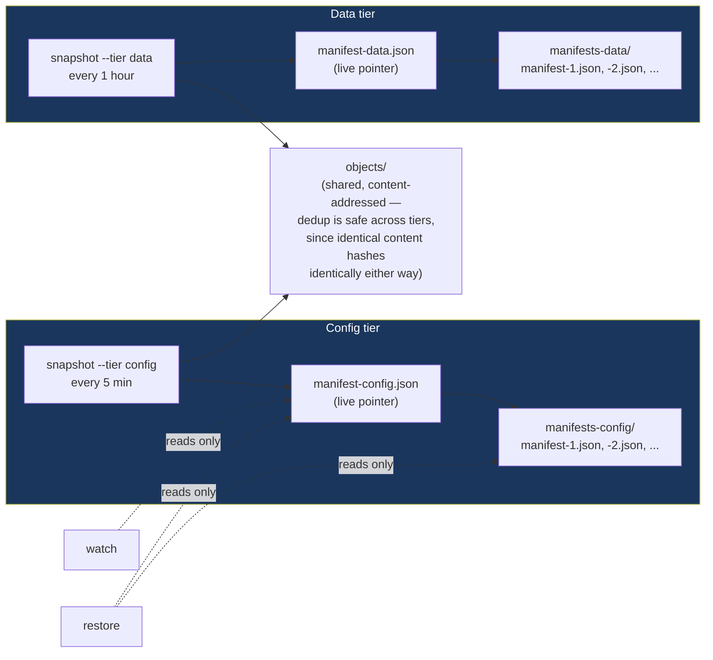
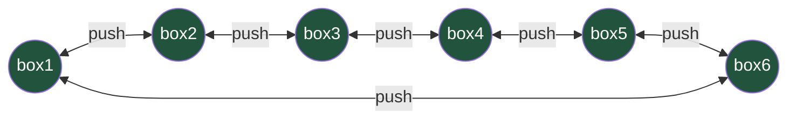
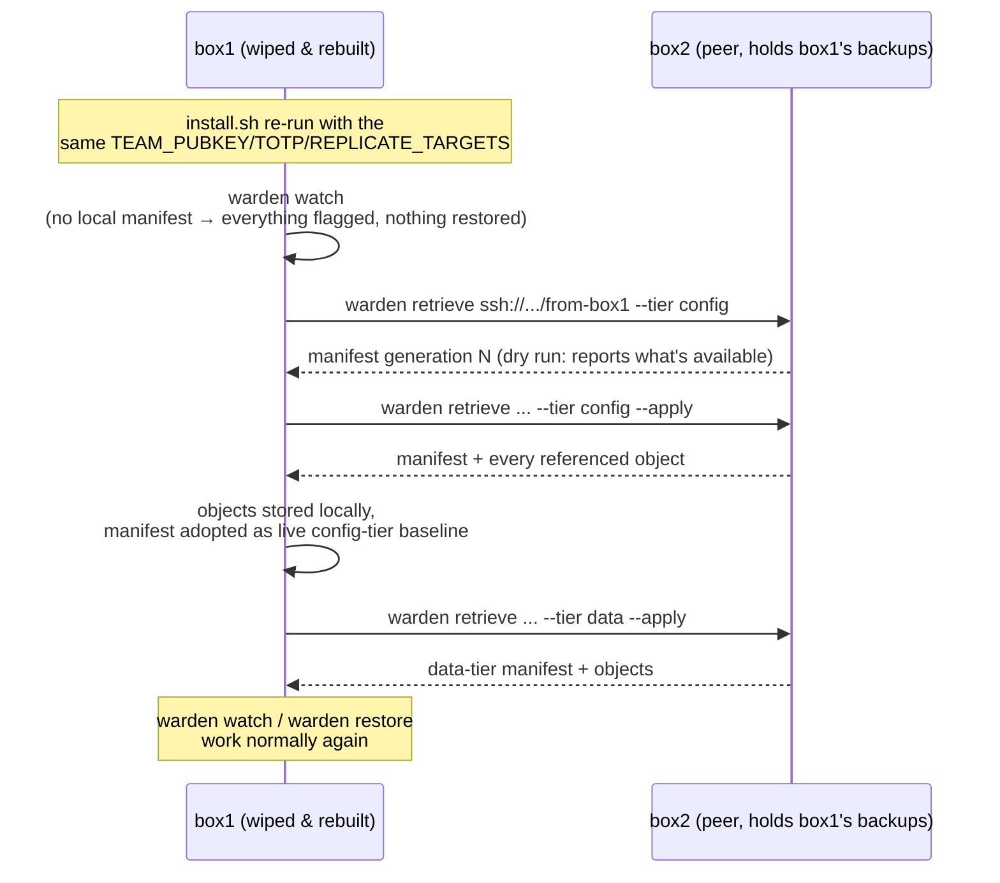

# Architecture Diagrams

Visual companions to [DESIGN.md](DESIGN.md) (why it's built this way) and [USAGE.md](USAGE.md) (what each command does). GitHub renders these Mermaid blocks natively.

## Component overview

What runs on one box, and how the pieces connect. Nothing here is a long-lived process — every box on the left is a systemd timer or cron entry invoking the binary briefly, then exiting.

```mermaid
flowchart TB
    subgraph Triggers["Triggers (systemd timers + cron)"]
        T_watch["*-watch.timer\nevery 5min ± 90s"]
        T_snapcfg["*-snap-cfg.timer\nevery 5min ± 60s"]
        T_snapdata["*-snap-data.timer\nevery 1h ± 5min"]
        T_sentinel["*-sentinel.timer\nevery 10min ± 2min"]
        T_cron["cron entry\nevery 10min"]
        T_replicate["*-replicate.timer\nevery 15min ± 3min"]
    end

    subgraph Binary["warden binary (one file, disguised name)"]
        watch["watch"]
        snapshot["snapshot --tier config|data"]
        sentinelcheck["sentinel-check"]
        replicate["replicate"]
        restore["restore"]
        opmenu["opmenu\n(forced command only)"]
    end

    subgraph State["/var/lib/&lt;binary-name&gt;/ (named to blend in)"]
        manifests["manifest-config.json\nmanifest-data.json\nmanifests-config/\nmanifests-data/"]
        objects["objects/\n(content-addressed, gzip)"]
        auditlog["audit.log\n(JSON lines)"]
    end

    subgraph External["Outside this box"]
        watchedfiles["Watched files\n/etc/passwd, nginx.conf, ..."]
        akeys["/root/.ssh/authorized_keys"]
        units["/etc/systemd/system/*.timer/.service"]
        peers["Replication peers\n(other boxes in the mesh)"]
        operator["Operator's SSH client\n(team key + TOTP)"]
    end

    T_watch --> watch
    T_snapcfg --> snapshot
    T_snapdata --> snapshot
    T_sentinel --> sentinelcheck
    T_cron --> sentinelcheck
    T_replicate --> replicate

    watch <-- "read only" --> manifests
    watch <-- "read for repair" --> objects
    watch --> auditlog
    watch <-- "diff / auto-restore" --> watchedfiles

    snapshot --> manifests
    snapshot --> objects
    snapshot --> auditlog
    snapshot <-- "hash + read" --> watchedfiles

    sentinelcheck <-- "check / recreate" --> akeys
    sentinelcheck <-- "check / recreate" --> units
    sentinelcheck <-- "check / recreate" --> T_cron
    sentinelcheck --> auditlog

    replicate <-- "push (additive-only)" --> peers
    replicate --> manifests
    replicate --> objects

    restore <-- "pull known-good" --> objects
    restore --> watchedfiles
    restore --> auditlog

    operator -- "ssh, key forces command=" --> opmenu
    opmenu --> restore
    opmenu -.-> sentinelcheck
    opmenu --> auditlog
```

## Persistence: how it survives a kill attempt

The actual persistence mechanism isn't a running process — there's nothing to `kill -9`. It's three independent *registrations* (a systemd timer, a cron entry, and an `authorized_keys` line) that each independently trigger `sentinel-check`, which verifies all three exist and rebuilds whichever doesn't.

**Why killing one doesn't kill persistence**: `sentinel-check` is triggered by *two* of the three registrations (the timer and the cron entry), so removing either trigger still leaves the other one calling `sentinel-check`, which then notices and rebuilds whatever's missing — including, if it comes to it, the trigger that just fired it. The `authorized_keys` line has no trigger of its own; it's purely a target `sentinel-check` verifies and restores. All three would have to be destroyed in the same instant, before the next timer or cron tick, to actually cut off access for good — and even then, the box's watched files are still being auto-reverted by `watch` in the meantime, so read team's edits to *those* don't stick either.

**Why this doesn't add new attack surface**: nothing here opens a new listening port. The forced-command entry piggybacks on `sshd`, which is already running (and already the thing red team would need to get past to reach a real shell anyway). `opmenu` never execs a shell itself except after a valid TOTP code, and every other path — `status`, `restore` — stays inside the Go binary.

## opmenu: what happens on a forced-command connection

## Watch: detect, classify, act

## Backup lineage: two tiers, never sharing a baseline

Keeping these separate is why `install.sh` running `snapshot --tier config` immediately followed by `snapshot --tier data` doesn't erase either tier's baseline — an earlier version of this shared one `manifest.json`, and the second snapshot silently wiped out what the first one had just established (see `docs/PLAN.md` Phase 6).

## Mesh replication and recovery (multiple boxes)

A bidirectional ring across N defended boxes: every box pushes to both neighbors, so every box's data has 3 total copies (itself + 2 neighbors) and every replication relationship is mutual.

Each arrow is additive-only in both directions: `box2` can only ever add files under its own `from-box1` subdirectory (a restricted, non-root receiving account enforces this), never delete or overwrite what's already there — so even a fully compromised `box1` can't destroy the copy of its own data sitting on `box2`.

