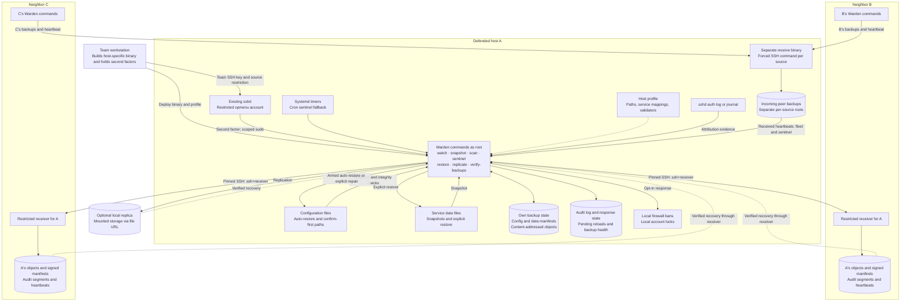

# Warden

Design notes for the persistence and backup/restoration system.

Updated September 22, 2026

## Project Description

Warden is a Go binary for the CofC Cybersecurity Club's SECCDC/PCDC defense team. It maintains restricted SSH access and backs up and restores selected configuration files and service data.

## Overview and Goals

Warden is designed to retain repair access when processes, keys, or scheduled registrations are removed.

Core constraints:

1. Survives kill attempts: no single point of failure. Killing one process or removing one config entry should not permanently cut access.
2. No new attack surface: prefer piggybacking on services already running rather than opening new listeners.
3. Retains access to status, restore, and authenticated repair commands.
4. Team-only: access is restricted to the defense team's key and source IP, not a general-purpose backdoor.
5. Auditable: every action Warden takes is logged, so the team can show exactly what it did if questioned.

## Deployment layout

Each defended host runs the same short-lived Warden commands. Systemd timers schedule checks and snapshots; cron provides a second trigger for sentinel. There is no central Warden server. The diagram expands host A and shows its two backup neighbors.



The solid replication arrows carry objects, manifests, audit segments, and heartbeats. Dotted recovery arrows show reads of A's own copies through configured receivers or local storage. Recovery verifies object hashes before caching bytes. Signature enforcement requires the source's manifest public key to be configured; the signature labels show that deployment option.

The main host binary is root-only and contains its compiled credentials. Receiving accounts execute a separate, root-owned receiver binary built without those credentials. Each receiving SSH key is forced into one storage root; the protocol provides no delete, rename, shell, or retention command. The receiving administrator controls retention and quotas. Legacy `ssh://` targets use a shell transport and do not provide this receiver boundary.

B and C also maintain their own local baselines and replicate to their neighbors. Incoming copies on A are separate from A's own object store. `fleet` and sentinel read received heartbeats, but a heartbeat does not establish backup integrity. `verify-backups` checks the configured backup copies; its default mode only reports results.

## Access boundaries

Operator SSH access uses the team's key and configured source address. Restore and shell also require a second factor. The dedicated account's managed key file contains only that restricted key; installation and sentinel repair replace additional entries. Its sudo rule permits only `opmenu`, so access to that Unix account does not grant unauthenticated use of other root commands. Concurrent TOTP requests share a process lock, and unreadable or malformed replay state rejects authentication.

The local CLI trusts root. An attacker who controls root on a defended host can replace the binary, read its compiled secrets, or change SSH and sudo policy. Warden cannot enforce blue-team-only access against that attacker. Keep the team's private login key off defended hosts, use separate receiving credentials for each source, and keep recovery copies on machines outside the compromised host's control. Stronger authorization requires an external signing or approval service whose private keys never reside on defended hosts; that service is not implemented.

Receiver credentials authorize backup protocol operations only. They do not authorize an operator shell. A stolen receiving key can still read backups in its assigned root and consume its storage quota. Use per-source filesystem quotas and restrict network access; protocol-level quotas are a follow-up.

## Architecture Decision: Separate Binary

Warden ships as its own compiled binary, kept separate from any other tooling the team runs on the box (enumeration scripts, monitoring agents, and the like).

Keeping Warden separate from enumeration and monitoring tools isolates its credentials, permissions, and recovery functions from those tools.

## Language and Build Strategy

Go, for reasons specific to this use case:

1. Static binaries. `CGO_ENABLED=0 GOOS=linux GOARCH=amd64 go build` produces one file with zero runtime dependencies: no Python interpreter mismatch, no missing packages, nothing that relies on the target box's own tooling being intact.
2. Cross-compilation. Warden is built ahead of the competition wherever the team has a machine and permission to run `go build`, whether or not that's an official team laptop. If no such machine exists, see the build-location contingency later in this section. No compiler and no internet access are needed on the box itself.
3. No trust in system binaries for core logic. Given the team's own threat model (altered binaries, misconfigs), Warden's snapshot store and replication channel are pure Go, using only the standard library plus one vetted dependency (`golang.org/x/crypto/ssh`) for the off-host push. It never shells out to git, rsync, or tar, since any of those could be the exact binary red team has already altered.
4. Stripped binaries. Build with `-ldflags="-s -w"` to strip debug symbols, keeping the binary small and slightly harder to reverse casually.
5. Vendor dependencies (`go mod vendor`) before the competition, so a build never needs internet access.

## Repository and Package Structure

```
warden/
  cmd/warden/main.go        # Cobra root, wires subcommands to internal packages
  internal/
    manifest/               # hash format, load/save, diff
    store/                  # content-addressed snapshot storage
    replicate/               # off-host push, pure-Go SSH client
    watch/                   # integrity checking loop
    restore/                 # restore workflow
    audit/                   # append-only log writer
    opmenu/                   # forced-command handler for the access layer
    sentinel/                 # self-check-and-respawn logic
    totp/                     # minimal RFC 6238 implementation
  deploy/
    systemd/                 # unit + timer templates
    install.sh                # one-shot deploy script, run once per box
```

Conventions: each `internal/` package exposes a constructor (`manifest.New(path string) (*Manifest, error)`), no package-level globals, no `init()`. Cobra subcommands in `cmd/warden` stay thin and call into these packages, so every piece is independently testable.

Cobra subcommand surface:

| Command | Purpose |
| --- | --- |
| `warden snapshot` | Take a backup snapshot (config or data tier) |
| `warden replicate` | Push new snapshot objects to the off-host target |
| `warden watch` | Run one integrity check pass |
| `warden restore <target>` | Restore a target from a snapshot |
| `warden sentinel-check` | Verify the sentinel pair and respawn if needed |
| `warden opmenu` | Forced-command handler, never invoked directly by a human |

## Component: manifest Package

the single source of truth for what known-good state looks like. Every other component reads from or writes to this.

1. Define a record: file path, SHA-256 hash, file mode, mtime, and a class field (safe-auto-restore or confirm-first). The class split is what lets the watcher decide whether to fix something immediately or flag it for a human.

   Use confirm-first when an automatic restore could undo a legitimate change. The defaults are `/etc/shadow`, `/etc/gshadow`, and saved firewall rules. SSH, passwd, group, sudoers, and PAM files are auto-restored because changes to them can block repair access.

## Component: store Package (Backup Engine)

versioned, content-addressed storage for file contents, without depending on external tools.

1. Skip git, tar, and rsync. Build a minimal content-addressed store: hash each file's contents with SHA-256, write the content once to `objects/<hash prefix>/<hash>`, compressed with `compress/gzip` from the standard library. Skip the write if the object already exists.
2. A snapshot is a manifest pointing at object hashes, not a full copy of every file. Cheap, fast, and easy to diff.
3. Two tiers: a fast tier for config-sized files, run every few minutes; a slower tier for larger service data, run hourly. Implement as two separate Cobra invocations with different target lists, scheduled by two different systemd timers.
4. Retention: on each snapshot, prune object files no longer referenced by any of the last N manifests. Simple mark-and-sweep.
5. **An armed box's config baseline is frozen.** While armed, a config-tier snapshot keeps the existing record for any path that drifted, deleted or appeared since, records which paths it declined, and writes no new generation at all when nothing moved.

   `snapshot` and `watch` run on independent schedules. Without the armed-state check, a snapshot could accept an attacker's edit before watch restored it. While armed, only `accept` and `arm` update the config baseline.

   Data snapshots continue to capture service data while armed.

## Component: replicate Package (Off-Host Push)

get snapshots off the box so a root compromise doesn't take the backups with it.

1. Use `golang.org/x/crypto/ssh` directly to push new objects and the manifest to a second team-controlled box. This is a deliberate exception to the no-external-dependencies rule, since implementing SSH from scratch isn't a good use of competition prep time and this library is widely used and auditable. Vendor it ahead of time.
2. Authenticate with a key generated only for this purpose, not a personal or team login key.
3. Push is additive-only from the source box's perspective: it can write new objects, never delete or overwrite existing ones on the destination. This is client behavior. The SSH receiving account can delete writable files; protecting backups from a stolen key requires server-side restrictions or independent retention.
4. If no second box is available, point this package at a different local filesystem path (removable media) instead of a network destination. Same interface either way.
5. Audit data is sent as immutable segments under `<root>/audit/` using `Target.PutAudit` and `AuditSegmentName`. Per-peer offsets and digests in `<dataDir>/audit-replicated.json` track appended data and detect rotation so unsent tails are retained. `retrieve --audit` reconstructs the JSON-lines log. Each entry includes its host.

## Component: heartbeat Package (Dead-Man's Switch)

report missing heartbeats from replication peers.

Local logs and status cannot report a host that is powered off or disconnected. Peers detect the absence of its expected heartbeat.

1. Each push writes `<root>/heartbeat/<host>-<nanos>.json` through the existing replication channel. It contains hostname, timestamp, expected interval, armed state, manifest generation, recent passes, and active ban/lock counts.
2. The sender declares its own interval rather than the reader assuming one, so boxes replicating on different schedules judge each other correctly instead of the slowest one looking permanently dead.
3. Sentinel reads received heartbeats and logs one overdue alert per outage, followed by `peer-returned` when reporting resumes.
4. `warden fleet` is the human view of the same data: this box's own current state, then every peer that reports here, with anything overdue marked. In the documented ring topology each box sees its two neighbours; pointing every box's `REPLICATE_TARGETS` at one additional box makes that box a full fleet view, with no other change.
5. Heartbeats do not trigger automatic response. Reboots and network failures can delay them, and anyone with write access to the receiving directory can forge them.

## Component: watch Package (Integrity Checker)

compare watched files with the approved baseline and restore or flag changes.

1. Not a long-lived daemon. Invoke via a systemd timer at a jittered interval, so the check doesn't have a fixed, fingerprintable period. Each run: generate a fresh manifest of watched paths, diff against the last known-good manifest, act on differences, exit.
2. When armed, restore changed safe-auto-restore files from the store and call `systemctl reload-or-restart` once per installed unit per pass. Log failures and continue with remaining files. Leave confirm-first files unchanged and log alerts.
3. Include Warden's own dependencies (any external binary it ends up trusting) in the watch list too, closing the gap where the tool meant to catch altered binaries could itself be undermined by one.

## Component: opmenu Package (Access Layer)

handle the restricted SSH command menu.

1. Store the key in a dedicated non-root account with `command="sudo /usr/local/sbin/warden opmenu",from="<team IP>",no-port-forwarding,no-X11-forwarding,no-pty <key>`. The account name derives from the installed binary. `/etc/sudoers.d/<name>` grants passwordless sudo for the exact `opmenu` invocation only and preserves `SSH_ORIGINAL_COMMAND` and `SSH_CLIENT`. This works with `PermitRootLogin no`.
2. Read `$SSH_ORIGINAL_COMMAND` to see what the operator asked for (status, restore nginx, shell). Whitelist a small fixed set of accepted commands and reject everything else.
3. Require a second factor for restore and shell. TOTP uses `crypto/hmac` and `crypto/sha1`. A static passphrase in `StaticSecretPath` is accepted as an alternative and read on every check. The installer generates it; `rotate-secret` changes it without rebuilding. TOTP is checked first and remains available when a static factor is set.
4. Only the shell command, after the TOTP check passes, execs an actual shell (`syscall.Exec` into `/bin/bash`). Every other path stays inside the Go binary. Since `opmenu` itself is invoked via `sudo`, it's already running as root by the time this runs, so the resulting shell is a real root shell.
5. TOTP codes are single-use across opmenu and local accept/uninstall commands. `totp.ConsumeCounter` records the last accepted step in `<dataDir>/second-factor-spent` and rejects that step or earlier ones. Dry run and apply require different codes. The static passphrase remains reusable until rotated.
6. Log every invocation, successful or rejected, to the audit log: timestamp, source IP, command requested, whether the second factor passed.
7. Sentinel checks the sudoers rule as well as the SSH key. Generated sudoers content is validated with `visudo -cf` before installation.

## Component: sentinel Package (Self-Healing Pair)

verify and repair Warden's access and scheduling registrations.

1. Two independent triggers: a systemd timer and a separate cron entry, both running `warden sentinel-check`, registered two different ways so killing one registration doesn't kill both.
2. Each run checks: does the SSH key entry still exist (delegate to the manifest/watch logic rather than duplicating it); does the other trigger's registration still exist. Read the crontab file and the systemd unit file directly rather than shelling to `crontab -l` or `systemctl status`, to avoid trusting a binary that could be altered. Re-create whichever is missing.
2a. Register all Warden timers: watch, both snapshot tiers, scan, sentinel, and configured replication. Check the service file, timer file, and enabled symlink; recreation uses the installer's unit content and interval.
3. Keep each run short-lived and quiet: minimal log output outside the audit trail, and naming that matches whatever conventions already exist on the box rather than something generic.
4. Maintain a spare binary through the `binary-backup` registration. The cron command uses `test`, `cp`, and `chmod` to restore a missing binary before invoking it.

## Component: restore Package

the human-triggered "fix this now" path, separate from the automatic watch loop.

1. `warden restore <target> [--tier config|data] [--snapshot <id>] [--apply]`. Default to the latest snapshot, but allow an older one, since the most recent snapshot can already contain the bad state.
2. Dry-run shows a diff (old hash vs. current disk state) without touching anything. Make this the default when invoked through the opmenu's restore command, requiring an explicit `--apply` flag or confirmation to write.
3. On apply: stop the affected service if one maps to the target, pull content from the store, write it, reverify the hash post-write, restart the service, and log the whole sequence to the audit log.

## Component: Active Response (opt-in)

optionally block an attributed source IP at the defended host's firewall after a confirm-first change.

File changes do not identify the writer. Automatic bans therefore require SSH attribution evidence and exclude team addresses.

1. Parse SSH accepted/disconnected records from `/var/log/auth.log` or `/var/log/secure`. If neither exists, read sshd/sshd-session journal records from 24 hours before the change through now, with a ten-second timeout. Unreadable or unparseable logs provide no evidence.
2. Persist bans in `internal/autoban`; its `Firewall` interface supports fake-firewall tests and idempotent iptables rules.
3. `cmd/warden/react.go` handles confirm-first response separately from file integrity checks. Bans require:
   - An auth log or the system journal was read and parsed.
   - A root-authenticated SSH session overlapped the changed file's mtime.
   - A source outside `TEAM_FROM_IP` (exact address or CIDR) and outside addresses associated with the team key in the available logs. Suspects are limited to root sessions; team-key exclusions include all accounts.
   - One candidate non-team root IP. Zero or multiple candidates suppress the ban. Multiple IPs are recorded in `candidate_ips` for operator review. An attacker can suppress automatic attribution by creating another overlapping root session.
4. Log every result as `react`/`alert`, including the path, attributed IP/account, candidate IPs, and reasons for missing or ambiguous evidence.
5. Reconciliation processes each ban or lock independently, retains failures for retry, and reports errors together. Bans and account locks default to indefinite; `unban` and `unlock-account` remove them. Positive manual durations expire. Sentinel reapplies active firewall rules in case they were flushed.
6. Ban, unban, accept, and alerts are local commands available remotely through `opmenu shell`.
7. `warden alerts` reads react entries and displays them in the calling session. It does not broadcast to other users.
8. `accept <path> <code>` updates one config baseline record after validating a TOTP code or static second factor. Other paths are unchanged.

## Component: Anomaly Detection and Account Lockout (opt-in)

detect account, binary, cron, SSH-key, port, and package changes outside the watched-file checks. `warden scan` runs the six checks in `internal/anomaly` on its own timer.

Account locks, session termination, and firewall bans apply only to the defended host.

The six checks (`internal/anomaly/*.go`):

1. **Accounts:** detect new users/groups and changes to user UID, GID, home, or shell and group GID or membership. A changed user is recorded as the culprit; group membership changes do not identify their author. Comparing `getent passwd` with `/etc/passwd` also reports domain accounts without a local culprit.
2. **SUID/SGID binaries:** inspect `/usr/{,local/}{bin,sbin}`, `/bin`, and `/sbin`. Record paths and SHA-256 hashes to detect new files and content changes. The file owner is the culprit.
3. **Cron:** inspect root's crontab, `/etc/cron.d/*`, and per-user spool files. Exclude Warden's sentinel line before hashing. Per-user filenames identify the account.
4. **SSH keys:** inspect `/home/*/.ssh/authorized_keys` and `/root/.ssh/authorized_keys`, excluding Warden's own managed line.
5. **Listening TCP ports:** parse `/proc/net/tcp{,6}`, including the owning UID.
6. **Installed packages:** query dpkg or rpm. Package changes do not identify who performed the installation.

Each check stores JSON under `<dataDir>/anomaly/`. Account and SUID records include state as well as names. Legacy name-only entries are reseeded without alerts. The first run establishes a baseline without findings; later runs report changes.

**Reaction, once armed and only if built with `AUTOLOCK_ENABLED`/`AUTOBAN_ENABLED`:**

- Scan uses `attributeChange` for IP response, with the same evidence requirements and team exclusions as guarded-file response.
- `accountlock` exposes Store/Add/Remove/Reconcile with a `System` interface. Locking runs `passwd -l`, sets the shell to nologin, and attempts `pkill -KILL -u`. Unlock restores password access and the recorded previous shell.
- `canLockAccount` applies these exclusions to automatic and manual locks:
  1. Non-local accounts are excluded; directory accounts require changes in their directory service.
  2. Root and the opmenu account are excluded without override.
  3. `SAFE_ACCOUNTS` are excluded unless manual `--force` is used. Configure this list with team and scoring accounts.
- Scan responses require armed state as well as their build-time opt-ins. Guarded-file response does not require armed state.
- Findings use `react`/`alert` with `source: "anomaly"`. Manual overrides are `lock-account` and `unlock-account`.
- Uninstall unlocks recorded accounts before removing local state.

## Build and Deployment

Warden reaches the box by push, during the team's own initial setup window, not by pull from the box itself.

### No Clean Window: Assume Compromise

Check for existing compromise before installing credentials or approving a baseline. An implant already on the host may capture key material during setup.

### Delivery Mechanism

For the built *binary*, ruled out:

- `git clone` on the target: needs outbound access the box may not have, leaves the clone URL and a `.git` directory as an obvious artifact, and depends on the box's own git binary being intact, which the whole threat model assumes it might not be.
- `curl`/`wget` on the target: same egress and history problems, plus depends on curl/wget being present and un-tampered.

Instead: `scp` (or the team's own jump host, if the competition provides one) pushes the built binary onto each box once, during whatever grace period exists at the start of the competition, and only after the sweep above has confirmed the box is clean, not before.

### Build Location Contingency

Prefer building on a separate team-controlled machine. If none is available, use the on-host build procedure below.

`scripts/build-and-install.sh` builds and installs on the target. See DEPLOYMENT.md's "Alternative: build directly on the target box" section.

- Transfer the source with scp, clone it on the host, or use removable media. Vendored dependencies allow an offline build.
- `go build -ldflags -X` exposes compiled secrets in the host's process command line during the build.
- A vendored module cache (`make vendor`, run once on any internet-connected machine, brought along as part of the tree) lets the build run with zero network access from the target box at all; without it, `go build` needs the box itself to reach Go's module proxy or a configured mirror.
- After a successful install, the build script removes its checkout, dependencies, generated secrets, and build artifacts. `KEEP_SOURCE=1` retains them.
- On-host compilation requires a Go toolchain or a way to install one.

### Configuration

Per-competition values (the team's public key, the off-host replication target, the TOTP seed, the `from=` IP restriction) are baked into the binary at build time with `-ldflags -X`, not stored in a separate config file on disk.

These values are compiled into the binary to reduce separate credential files on the host. The binary still contains them and must be protected.

Changing a compiled value requires rebuilding and redeploying. Watched paths and service mappings can be supplied separately through `/etc/warden/profile.json`.

### Install Sequence

One script, run once, does the entire setup:

1. Confirm the box is clean of known beacons, keyloggers, and altered binaries. Assume compromise by default, not a clean starting point, and eliminate anything found before continuing.
2. Place the binary at a path and name that match conventions already on that box (check what's there before choosing).
3. Set restrictive permissions (0700, root-owned).
4. Write the systemd timer and unit files for the watch loop and the sentinel pair, and the cron entry for the sentinel's second trigger.
5. Create the dedicated, low-privilege account the access layer uses (same name as the binary), append the restricted authorized_keys line to its own `authorized_keys`, and grant it a `visudo`-validated `NOPASSWD` sudo rule scoped to exactly this binary.
6. Generate the initial manifest and take the first snapshot.
7. Generate a static second factor with `warden rotate-secret` and save the value printed during installation.
8. Verify by calling `warden opmenu status` once over loopback, confirming the access layer works before walking away from the box.
9. Delete the install script itself. It's a one-time-use file, and leaving it behind leaves a trace for red to find.

### Footprint and Evidence Policy

Warden does not scrub shell history or system logs.

Installation removes its setup files after verification. Shell history remains subject to the operator's shell configuration.

The audit log rotates at 8 MiB (`audit.MaxLogBytes`) and retains one previous file, `audit.log.1`. Readers include both files. Older entries require a replicated copy for recovery.

## Verification Plan

1. Unit tests per package: manifest hash round-trip, store put/get with dedup, watch diff correctness, TOTP against known RFC 6238 test vectors.
2. Integration test in a VM mirroring the target distro: install, kill the sentinel and confirm it respawns, edit a watched config and confirm it reverts, delete the SSH key and confirm it comes back.
3. Adversarial test before the real competition: have a teammate try to find and kill this on a box with no knowledge of where to look, timed, so the team knows its actual survival window rather than assuming one.

## Backup recovery

`cmd/warden/recovery.go` manages fallback across configured targets. Store reads verify decompressed bytes and recover missing or corrupt objects through a callback. Recovery tries local replicas before SSH peers, validates the expected hash, caches the recovered object, and records its source. Connections are reused for one operation and closed afterward.

Missing live manifests are recovered from local archives and replicas. Explicit generations stay exact; automatic selection chooses the newest readable generation. Recovery validates generation numbers, absolute unique paths, and object hashes. Builds configured with an Ed25519 manifest public key require signed source and tier metadata. Restricted receivers retain immutable generation records outside the source host; adoption of an older generation requires an explicit rollback override.

Restore and watch share this recovery store. Replication can refill its local store from another peer, and can reconstruct a missing archive from the live manifest. Armed snapshots attempt recovery before reading a changed live file and reject content that does not match the baseline. Retrieve dry runs read metadata only.


Mutating CLI operations share an advisory process lock. Manifests and response state publish through temporary files; archives reject conflicting writes. Object retention includes both active manifests. Account lock overlays are computed for restoration without altering the approved archive.

The restricted receiver accepts one JSON request through a forced SSH command and confines file operations with Go's directory-root API. Its protocol has no shell execution, deletion, or pruning operation. Source-specific receiver credentials and roots provide isolation; retention belongs to the receiving administrator. Legacy shell transport remains available for migration only.
